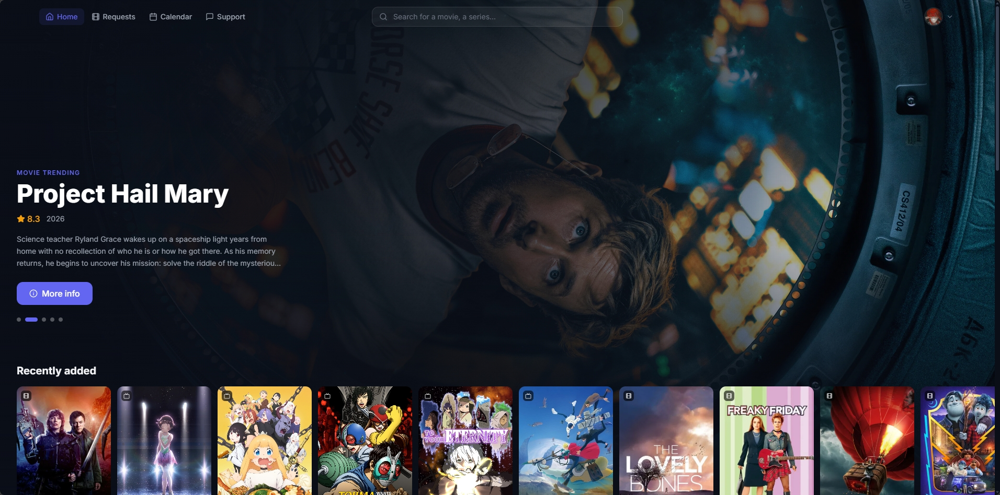

<p align="center">
  
</p>

<h1 align="center">Oscarr</h1>

<p align="center">
  A modern, self-hosted media request & management platform.
  <br />
  Radarr & Sonarr are the source of truth. Oscarr is the interface.
</p>

<p align="center">
  
  
  
  <a href="https://discord.gg/BKMaWhVCRr"></a>
  <br />
  <a href="https://sonarcloud.io/summary/overall?id=arediss_Oscarr"></a>
  <a href="https://sonarcloud.io/summary/overall?id=arediss_Oscarr"></a>
  <a href="https://sonarcloud.io/summary/overall?id=arediss_Oscarr"></a>
  <a href="https://sonarcloud.io/summary/overall?id=arediss_Oscarr"></a>
</p>

<p align="center">
  
</p>

<p align="center">
  <a href="#why-oscarr">Why Oscarr?</a> &middot;
  <a href="#features">Features</a> &middot;
  <a href="#tech-stack">Tech Stack</a> &middot;
  <a href="#quick-start-with-docker">Docker</a> &middot;
  <a href="#manual-setup">Manual Setup</a> &middot;
  <a href="#plugins">Plugins</a> &middot;
  <a href="#contributing">Contributing</a>
</p>

---

## Why Oscarr?

There are great tools out there for managing media requests. Oscarr doesn't aim to replace them — it offers a **different vision** of what this kind of tool can be.

The core idea: **Radarr and Sonarr are your source of truth**, not your media server. Oscarr syncs directly with your *arr instances, tracks what's available, what's downloading, and what's been requested — all from there. The media server (Plex, Jellyfin, or Emby) handles access control; the library state comes from where it actually lives.

Here's what makes Oscarr different:

- **Multi-service native** — Connect as many Radarr and Sonarr instances as you need. Define folder rules with priority-based routing, and let Oscarr figure out where each request should go based on genre, language, country, keyword tag, user or role. A 4K library, an anime Sonarr, a regional Radarr — it all coexists naturally.

- **Quality selection for users** — Let your users choose between SD, HD, 4K, or 4K HDR when requesting. Each quality maps to specific profiles per service, so the right content ends up in the right place.

- **Multi-provider auth** — Email + password, Plex OAuth, Jellyfin, Emby, or Discord — all toggleable independently. Signup control is per-provider, with a global kill-switch for the whole signup flow.

- **Plugin system** — Oscarr is extensible at its core. Plugins can register backend routes, frontend pages, scheduled jobs, notification channels, and UI contributions — all from a versioned manifest with capability-based permissions. Build what you need without forking the whole project.

- **Feature toggles** — Don't need the calendar? Turn it off. Support tickets? Toggle it. Every section is optional, controlled from the admin panel in real time.

- **Modern stack, fast UI** — React 19, Vite, Tailwind, Fastify. The interface is dark-themed, responsive, and snappy.

---

## Features

**For users**
- Browse trending, popular, and upcoming media from TMDB
- Search movies and TV shows instantly
- Request media with quality and season selection
- Track request status in real time
- **Upcoming releases calendar** — see what's coming out and when, right from the app
- **Audio & subtitle language badges** — available audio tracks and subtitles at a glance
- **Complete the collection** — own 3 out of 5 movies in a saga? One click to request the missing ones
- Cast + crew filmography (directors, producers — not just actors)
- Support ticket system to contact admins
- Web push notifications (VAPID)
- Multi-language support (English & French)

**For admins**
- Multi-instance Radarr & Sonarr management with a guided first-install wizard
- Intelligent folder routing with condition-based rules (genre, language, country, user, role, keyword tag)
- Quality profile mappings per service
- User management with media-server access verification
- Auth-provider management (email, Plex, Jellyfin, Emby, Discord) with per-provider signup control
- Notification matrix (Discord, Telegram, Email) per event type
- Scheduled sync jobs with CRON configuration
- Signed backup & restore (HMAC) with re-auth gate
- Feature toggles and incident banners
- Expandable application logs with stack traces — one-click copy to share an error
- Setup-progress checklist in the topbar until every required step is done
- Customizable site name and branding

**Architecture & security**
- Plugin engine with versioned context, capability gates, and service permissions
- SQLite + Prisma (zero-config, easy backups). Migrations auto-apply at boot
- JWT in HTTP-only cookies (no localStorage token)
- RBAC with fail-closed route permissions + per-prefix defaults
- CSRF gate on all admin routes (`X-Requested-With: oscarr`)
- SSRF guard on admin-typed URLs (opt-in strict mode for cloud/shared hosting)
- Helmet CSP + HSTS (opt-in via `FORCE_HTTPS`)
- Pino log redaction on headers, tokens, API keys
- Process-level error capture piped into the admin Logs tab
- Setup routes unmount post-install (supervised restart)

---

## Tech Stack

| Layer | Technology |
|-------|-----------|
| Frontend | React 19, Vite 8, Tailwind, React Router |
| Backend | Fastify 5, Prisma ORM, SQLite |
| Auth | Email/password, Plex OAuth, Jellyfin, Emby, Discord — JWT in HTTP-only cookies |
| Integrations | Radarr, Sonarr, TMDB, Plex, Jellyfin, Emby |
| Notifications | Discord, Telegram, Resend (email), Web Push (VAPID) |
| Scheduling | node-cron |

---

## Quick Start with Docker

### Docker Run

```bash
docker run -d \
  --name oscarr \
  --network host \
  -e JWT_SECRET=your_random_secret_key \
  -v oscarr-data:/data \
  ghcr.io/arediss/oscarr:latest
```

### Docker Compose

Create a `docker-compose.yml`:

```yaml
services:
  oscarr:
    image: ghcr.io/arediss/oscarr:latest
    container_name: oscarr
    restart: unless-stopped
    network_mode: host
    volumes:
      - oscarr-data:/data
      # - ./plugins:/app/packages/plugins  # Optional: mount a plugins directory
    environment:
      - JWT_SECRET=your_random_secret_key
      # - TMDB_API_TOKEN=your_own_key              # Optional: override the built-in TMDB key
      # - OSCARR_BLOCK_PRIVATE_SERVICES=true       # Strict SSRF guard (cloud/shared hosting)
      # - FORCE_HTTPS=true                         # Enable HSTS when served over HTTPS
      # - TRUST_PROXY=false                        # Set false only when exposed directly (no reverse proxy)

volumes:
  oscarr-data:
```

```bash
docker compose up -d
```

Open `http://localhost:3456` and follow the setup wizard.

> **Notes:**
> - `network_mode: host` is recommended so Oscarr can reach your Radarr/Sonarr/Plex instances on the local network.
> - Data (SQLite database, install config, backups) is persisted in the `oscarr-data` volume.
> - A built-in TMDB read-access token is included — no signup needed. Override with `TMDB_API_TOKEN` if you prefer your own.
> - Migrations run automatically at every boot (idempotent). No manual step required after an image update.
> - **macOS Docker Desktop caveat:** containers can't reach LAN IPs (e.g. `192.168.1.x`) even with `--network host` — Docker Desktop runs in a VM and doesn't share the host network stack. Connectivity tests that work for Linux/NAS users will fail from your Mac. Use [Colima](https://github.com/abiosoft/colima) locally for a true Linux-like network, or deploy to a Linux host for end-to-end testing. Oscarr itself is unaffected — this is purely a local dev environment quirk.

---

## Manual Setup

### Prerequisites

- Node.js 20+
- npm 9+
- A media server (Plex, Jellyfin, or Emby — optional, can be added later)
- A TMDB API key (optional — a built-in read-access token is provided, [get your own here](https://www.themoviedb.org/settings/api))

### Installation

```bash
git clone https://github.com/arediss/Oscarr.git
cd Oscarr
npm install --legacy-peer-deps
```

### Configuration

Create a `.env` file at the repo root. Only `JWT_SECRET` is strictly required:

```env
JWT_SECRET=your_random_secret_key
DATABASE_URL=file:./dev.db
PORT=3456
FRONTEND_URL=http://localhost:5173

# Optional
# TMDB_API_TOKEN=your_own_key              # Built-in fallback provided
# SETUP_SECRET=your_install_secret         # Gate the install wizard (recommended in prod)
# OSCARR_BLOCK_PRIVATE_SERVICES=true       # Refuse LAN / loopback URLs
# OSCARR_PLUGINS_DIR=/custom/plugins       # Override the plugins directory
# FORCE_HTTPS=true                         # Enable HSTS
# TRUST_PROXY=false                        # Direct-exposed (no reverse proxy)
# BACKUP_ALLOW_UNSIGNED=true               # Dev-only: accept unsigned backup archives
# VAPID_PUBLIC_KEY=…                       # Web push
# VAPID_PRIVATE_KEY=…
# VAPID_SUBJECT=mailto:admin@example.com
```

### Database setup

```bash
npm run db:generate
npm run db:migrate
```

Migrations also run automatically at every backend boot, so this step is only needed when working outside the normal boot flow (fresh clone, CI).

### Development

```bash
npm run dev
```

This starts both the frontend (`:5173`) and backend (`:3456`) concurrently.

### Production

```bash
npm run build
NODE_ENV=production node packages/backend/dist/index.js
```

### First launch

Open the app and follow the setup wizard — create an admin account, connect Radarr/Sonarr and (optionally) a media server, then kick off the first sync. Setup routes are unmounted automatically once install completes.

---

## Project Structure

```
oscarr/
├── packages/
│   ├── backend/          # Fastify API server
│   │   ├── src/
│   │   │   ├── routes/       # API route modules (auth, admin/*, media, requests…)
│   │   │   ├── services/     # Business logic (sync, backup, notifications, scheduler)
│   │   │   ├── providers/    # Auth + media providers (plex, jellyfin, emby, discord, email)
│   │   │   ├── plugins/      # Plugin engine (engine, loader, context, routes)
│   │   │   ├── notifications/# Notification registry + provider implementations
│   │   │   ├── middleware/   # RBAC + auth middleware
│   │   │   ├── bootstrap/    # Security, routes, plugins, jobs wiring
│   │   │   └── utils/        # SSRF guard, logEvent, prisma, cache…
│   │   └── prisma/           # Database schema & migrations
│   ├── frontend/         # React SPA
│   │   └── src/
│   │       ├── pages/        # Page components (admin/* included)
│   │       ├── components/   # Shared UI components + nav
│   │       ├── context/      # React contexts (auth, features, backend-gate)
│   │       ├── hooks/        # Custom hooks (useModal, useMediaStatus, useVersionInfo…)
│   │       ├── plugins/      # Frontend plugin system (loader, PluginSlot, DynamicIcon)
│   │       └── i18n/         # Translations (EN, FR)
│   └── plugins/          # Drop-in plugin directory (can be overridden via OSCARR_PLUGINS_DIR)
└── package.json          # npm workspace root
```

---

## Plugins

Oscarr supports a plugin system that lets you extend both the backend and frontend without modifying core code.

A plugin is a folder under `packages/plugins/` (or the path set by `OSCARR_PLUGINS_DIR`) with a `manifest.json`:

```json
{
  "id": "my-plugin",
  "name": "My Plugin",
  "version": "1.0.0",
  "apiVersion": "v1",
  "entry": "index.js",
  "capabilities": ["http", "jobs", "notifications"],
  "services": []
}
```

Plugins can:
- Register API routes (under `/api/plugins/<id>/*`)
- Add scheduled jobs
- Contribute UI pages, admin tabs, nav items, and header actions
- Send notifications through the registry
- Expose feature flags
- Access the database, settings, and a versioned `PluginContext`

Capabilities gate what a plugin is allowed to do; services gate which media-server integrations it can touch. Both are reviewed on install.

See [`docs/plugins.md`](docs/plugins.md) for the full plugin API, and [`docs/auth-providers.md`](docs/auth-providers.md) for building an auth provider.

---

## Vision

> *One app to rule them all.*

Oscarr's ambition goes beyond media requests. The core is designed to be a **unified dashboard for your entire homelab media stack** — and plugins are how it gets there.

The core handles what every setup needs: authentication, user management, notifications, routing rules, and a beautiful interface. Everything else — Radarr, Sonarr, Plex, download clients, media servers — connects through **providers and plugins**. Today, Radarr and Sonarr are built-in. Tomorrow, the community can build plugins for anything: Lidarr for music, Readarr for books, Bazarr for subtitles, monitoring dashboards, storage analytics, or entirely custom workflows.

This is the guiding philosophy:

- **The core stays lean** — Authentication, UI shell, plugin engine, notification system. No hardcoded integrations that don't belong in every setup.
- **Plugins do the heavy lifting** — Each service integration is a self-contained plugin that registers its own routes, pages, jobs, and settings. Want to add Jellyfin support? Build a plugin, not a fork.
- **Modular by default** — Every feature is toggleable. Every integration is optional. You compose the app that fits your stack.
- **User-friendly always** — A fast, polished interface that non-technical users actually enjoy using. No config files, no terminal commands.
- **Community-driven** — Open source, actively maintained, and designed for contributions. Build a plugin, share it, help shape the ecosystem.

---

## Contributing

Contributions are welcome! Whether it's a bug fix, a new feature, or a plugin — feel free to open an issue or submit a PR.

- [`CONTRIBUTING.md`](CONTRIBUTING.md) — dev setup, conventions, PR expectations
- [`CONTRIBUTORS.md`](CONTRIBUTORS.md) — everyone who's shipped code to Oscarr

> **Development workflow** — This project uses [Claude Code](https://claude.com/claude-code) as a development assistant for code reviews, security audits, brainstorming, documentation, and issue/PR management. All architecture decisions and implementation are made by the maintainers — Claude serves as a quality and productivity tool, much like a linter or a CI pipeline.

---

## Verifying image provenance

Published `ghcr.io/arediss/oscarr` images are keyless-signed by the GitHub Actions release
workflow (Sigstore / cosign, via workflow OIDC — no long-lived keys to manage). Each signed
manifest also carries an attached SPDX SBOM attestation.

Verify before pulling into production:

```bash
cosign verify ghcr.io/arediss/oscarr:latest \
  --certificate-identity-regexp 'https://github.com/arediss/Oscarr/.github/workflows/release.yml@.*' \
  --certificate-oidc-issuer https://token.actions.githubusercontent.com

# Inspect the SBOM
cosign download sbom ghcr.io/arediss/oscarr:latest > oscarr.sbom.spdx.json
```

Any image without a valid signature from this workflow is not an official Oscarr release.

---

## License

MIT
